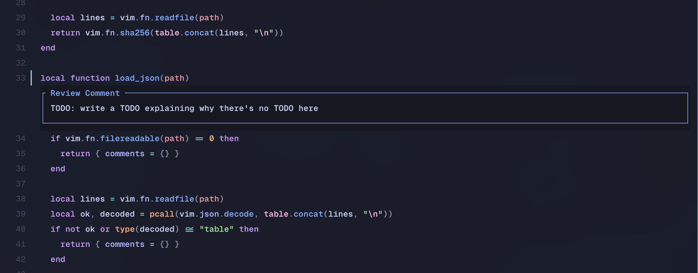

# local-review.nvim

## Bring your own review workflow

**local-review.nvim doesn't try to reinvent code review.**

There are already great Neovim tools for exploring diffs and reviewing changes — use Diffview, Neogit, CodeReview, or simply your normal buffers. `local-review.nvim` is designed to complement them by doing one small thing well: **adding inline review comments to your existing workflow.**

Leave comments directly on your code while you review it. Keep them local, export them as structured feedback for a coding agent, or submit them directly as a GitHub PR review.

It works the other way too: pull existing GitHub PR review comments into Neovim and see them alongside your own local feedback.

The idea is simple:

**Bring your own review workflow. `local-review.nvim` just adds the comments.**

```text
Diffview / Neogit / CodeReview / normal buffers
                         │
                         ▼
                 inspect your code
                         │
                         ▼
                 local-review.nvim
                      comments
                    ╱    │    ╲
                   ╱     │     ╲
              local   AI agent   GitHub
                              review
```

Use the tools you already like for navigating and understanding changes. `local-review.nvim` provides the small, composable layer between **reviewing the code** and **doing something with your feedback**.



Neovim plugin for local code review, built for use with coding agents.

> Fork of [ssundarraj/local-review.nvim](https://github.com/ssundarraj/local-review.nvim), heavily extended: multi-line ranges, dual anchors, stale detection, concurrency-safe storage, tests and CI.

Add, edit and delete comments on lines of code while reviewing, then export them as agent-ready text. Use your existing diff-viewer for diffs.

https://github.com/user-attachments/assets/e44d0e04-ad6c-405f-b1db-daac858153b4

Use the included [skill](./skills/local-review/SKILL.md) that tells agents how to read comments.

## Features

- **GitHub PR review comments** — pull unresolved inline review threads with `:LocalReviewGhPull` and view them as read-only comments; `:LocalReviewGhPull` also fetches PR-level review bodies and opens them in a read-only split that persists for the session. Both are cleared on `:LocalReviewGhClear` or when Neovim restarts
- **Multi-line comments** — visually select lines, comment covers the range; every line gets a gutter sign, the box renders below the last line, export shows `file.lua:3-5`
- **Context anchors** — comments follow the code when the file changes; both ends of a range are anchored independently
- **Stale detection** — when the anchored code is gone, the comment is marked stale (orange sign, `[stale]` in the title) instead of pointing at the wrong code
- **Git-style gutter marker** — `▎` in `LocalReviewMarker` (blue), grouped with git signs by statuscolumn plugins (e.g. snacks.nvim)
- **Concurrency-safe storage** — two Neovim instances on the same repo merge instead of clobbering each other
- **Safe export** — exported comments are only cleared after a confirmed clipboard write
- **Recoverable delete** — deleting a comment yanks its body to the unnamed register
- **Telescope picker + quickfix list** — with range display and range highlighting
- **Vim help** — `:h local-review`
- **Tested** — busted suite for the core logic, CI runs tests, typecheck and stylua

## Installation

Use your preferred plugin manager. Example with `lazy.nvim`:

```lua
{
  "abelfubu/local-review.nvim",
  opts = {
    keymaps = {
      comment = "<leader>rc",
      delete = "<leader>rd",
      next = "]r",
      prev = "[r",
      export = "<leader>re",
      list = "<leader>rl",
      hover = "K", -- press K on a commented line to peek the comment
    },
    comment_close_keys = {
      { modes = { "n" }, key = "q" },
      { modes = { "n", "i" }, key = "<C-c>" },
    },
  },
}
```

See `:h local-review` for the full reference.
Set any keymap to `false` to disable it (e.g. `hover = false`).

### Skill

Copy or symlink the skill into your preferred harness's skills directory.

### Telescope

If you use Telescope, you can open a picker for all review comments in the current repo:

```lua
vim.keymap.set("n", "<leader>lr", function()
  require("local_review.telescope").comments()
end, { desc = "Local Review Picker" })
```

## Commands

- `:LocalReviewComment` open the comment editor for the current line; accepts a line range (`:'<,'>LocalReviewComment`) or a visual selection via the keymap
- `:LocalReviewDelete` delete the comment covering the current line (its body is yanked to the unnamed register first, so `p` recovers it)
- `:LocalReviewNext` / `:LocalReviewPrev` jump between review comments in the current file and echo a one-line summary
- `:LocalReviewExport [path]` copy review comments for a path to the system clipboard in a copy/paste-friendly format, then delete the exported comments if the clipboard copy succeeded. In headless mode the output is printed to stdout so agent skills can read it and the comments are still cleared. If path is omitted, it uses the current repo root when available, otherwise `cwd`.
- `:LocalReviewExportPreserve [path]` copy review comments to the system clipboard without deleting them. In headless mode the output is printed to stdout. If path is omitted, it uses the current repo root when available, otherwise `cwd`.
- `:LocalReviewGhPull` fetch unresolved inline PR review comments and PR-level review bodies from GitHub for the current branch and display them as read-only comments; when review bodies are present, the command auto-opens a read-only split with them. Requires the `gh` CLI and a PR for the current branch.
- `:LocalReviewGhClear` clear the pulled PR comments and review bodies for the current scope
- `:LocalReviewClear [path]` delete stored review comments for a path. If path is omitted, it uses the current repo root when available, otherwise `cwd`.
- `:LocalReviewList [path]` list review comments in the quickfix list. If path is omitted, it uses the current repo root when available, otherwise `cwd`.

Pulled GitHub comments and review bodies are session-temporal: they live in memory only, are tied to the branch that was checked out when `:LocalReviewGhPull` ran, and disappear when Neovim restarts or when `:LocalReviewGhClear` is used. The review bodies split persists for the session, so you can close it and navigate back with normal buffer switching (`:b`, `<C-^>`, pickers). Re-running `:LocalReviewGhPull` refreshes the existing buffer in place. Switching branches hides pulled comments and review bodies until you re-run `:LocalReviewGhPull` on the matching branch.

Comments can only be added to real file buffers; scheme-prefixed buffers (`diffview://`, `fugitive://`, `oil://`, ...) are rejected with a notification. The working-tree side of a diff is a real buffer and works fine.

## Skills

- [`local-review`](./skills/local-review/SKILL.md) reads comments with `:LocalReviewExport`, which deletes exported comments by default.
- [`local-review-preserve`](./skills/local-review-preserve/SKILL.md) reads comments with `:LocalReviewExportPreserve`, which leaves comments in place.

## Notes

- The inline comment editor starts in insert mode. `<Enter>` inserts a newline, `<Esc>` returns to normal mode, and `<Enter>` in normal mode (or the configured `comment_close_keys`) accepts the comment and closes the editor. By default `q` closes in normal mode and `<C-c>` closes in normal or insert mode.
- Comments are stored by scope root: repo root when inside git, otherwise the file's parent directory.
- Export and clear can target either a file or a directory.
- Issues/PRs welcome but please open an issue before making a large change.
